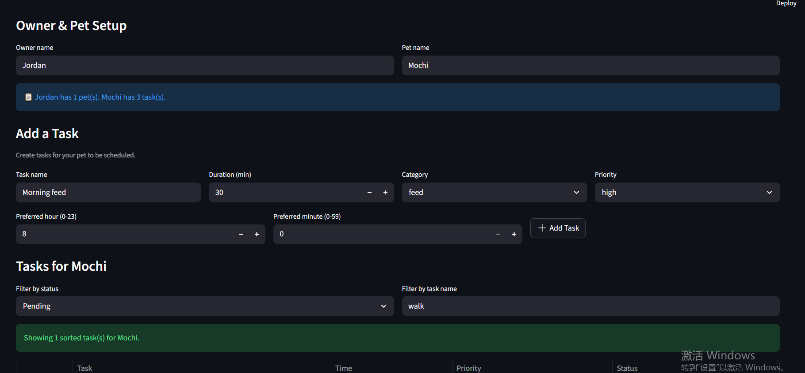

# PawPal+ (Module 2 Project)

PawPal+ is a Streamlit app that helps pet owners plan daily care tasks using a rule-based scheduler.

## Scenario

A busy pet owner needs help staying consistent with pet care. They want an assistant that can:

- Track pet care tasks (walks, feeding, meds, enrichment, grooming, etc.)
- Consider constraints (time available, priority, owner preferences)
- Produce a daily plan and explain why it chose that plan

This project includes object-oriented domain modeling, scheduling logic, recurrence handling, and a Streamlit interface for interactive planning.

## Features

- Priority-first scheduling: tasks are ordered by priority (HIGH -> MEDIUM -> LOW), then by preferred time and duration.
- Chronological task view: tasks can be sorted by time (HH:MM), with unscheduled items grouped at the end.
- Linear gap-scan slot placement: scheduler finds the earliest valid time window without brute-force probing.
- Time-window constraint merging: owner preference windows are intersected with task windows before scheduling.
- Conflict warnings (non-fatal): duplicate requested times and any post-schedule overlaps are surfaced as warnings.
- Recurrence support: completing daily/weekly tasks auto-creates the next occurrence.
- Due-date logic: one-time, daily, weekly, and occurrence-bound (`scheduled_for`) tasks are handled consistently.
- Filter and retrieval helpers: filter by status, task name, pet name, category, and high-priority view.
- Explainable scheduling: each scheduled task includes reasoning text for placement decisions.

## 📸 Demo



## What you will build

Your final app should:

- Let a user enter basic owner + pet info
- Let a user add/edit tasks (duration + priority at minimum)
- Generate a daily schedule/plan based on constraints and priorities
- Display the plan clearly (and ideally explain the reasoning)
- Include tests for the most important scheduling behaviors

## Smarter Scheduling

Recent scheduler improvements include:

- Faster slot finding using a linear gap-scan approach instead of broad candidate probing.
- Strict preferred-time handling for tasks that require exact timing.
- Recurring task rollover: completing daily/weekly tasks automatically creates the next occurrence.
- Lightweight conflict detection that adds warnings (same-time requests or overlaps) without crashing the app.
- Convenience tools for sorting/filtering tasks by time, completion status, task name, and pet name.

## Getting started

### Setup

```bash
python -m venv .venv
source .venv/bin/activate  # Windows: .venv\Scripts\activate
pip install -r requirements.txt
```

### Run the app

```bash
streamlit run app.py
```

### Suggested workflow

1. Read the scenario carefully and identify requirements and edge cases.
2. Draft a UML diagram (classes, attributes, methods, relationships).
3. Convert UML into Python class stubs (no logic yet).
4. Implement scheduling logic in small increments.
5. Add tests to verify key behaviors.
6. Connect your logic to the Streamlit UI in `app.py`.
7. Refine UML so it matches what you actually built.

## Testing PawPal+

Run the automated test suite with:

```bash
python -m pytest
```

Current tests cover core scheduler behavior, including:

- Sorting correctness for priority and chronological task views.
- Recurrence logic, including rolling daily and weekly tasks forward after completion.
- Conflict detection for overlapping schedules and duplicate requested times.
- Filtering and retrieval helpers (by pet, status, category, and name).

Latest result: 29 tests passed.

Confidence Level: 5/5 stars.
